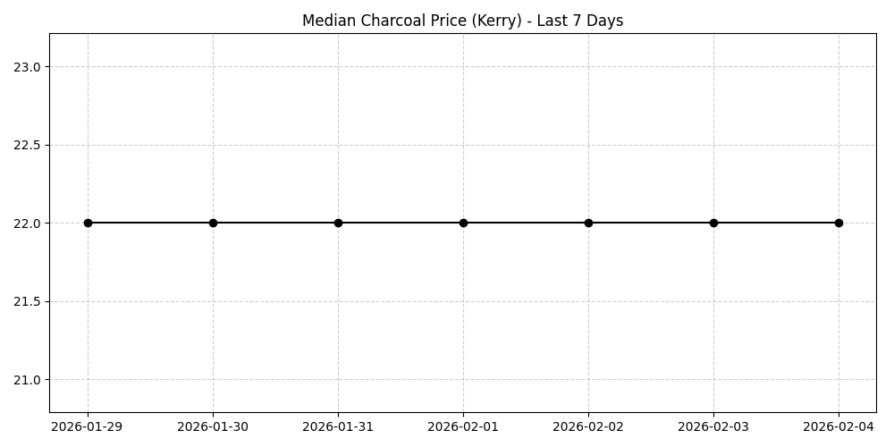

# 📈 Market Intelligence Report (Bloomberg Style)
**Date:** 2026-02-04
**Scope:** Last 7 Days | **Analyst:** Antigravity AI
## 0. 📰 Market Pulse (Intro)
| Benchmark | Global Median | Kerry Median | Top Region (Demand) |
|-----------|---------------|--------------|---------------------|
| **Iron Ingot** | 115.0g (+15.0%) | 80.0g (-15.8%) | Inis Gallia |
| **Wrought Iron Ingot** | 150.0g (-14.3%) | 165.0g (+10.0%) | Ancien |
| **Steel Ingot** | 480.0g (+20.0%) | 480.0g (+14.3%) | Kerry |
**Executive Summary:** Market activity in Kerry shows mixed signals compared to the global averages. The following sections detail key sector movements.
## 1. 🏭 The Coal-Steel Index (CSI)
**Purchasing Power Parity:**
- **Today:** 1 Steel Ingot = **21.8** Charcoal
- **7 Days Ago:** 1 Steel Ingot = **19.1** Charcoal

## 2. ⚔️ Weaponsmithing
### 🏆 Top Churn (Kerry Sales Est.)
1. **Wrought Iron Chopping Axe**: ~183 Sold | Est. Price: 25.0g (0.0% 7d)
2. **Iron Chopping Axe**: ~148 Sold | Est. Price: 9.0g (-10.0% 7d)
### 🚀 High Inflation (Opportunity)
- **Spear Shaft**: +100.0% (Current: 10.0g)
- **Attuned Bronze Handspear**: +66.7% (Current: 5.0g)
**Global Hotspot:** **Ancien** leads activity, driven by **Iron Chopping Axe**.
## 3. 🛡️ Armorsmithing
### 🏆 Top Churn (Kerry Sales Est.)
1. **Pilgrim's Helmet**: ~80 Sold | Est. Price: 3.0g (0.0% 7d)
2. **Simple Chest**: ~59 Sold | Est. Price: 45.0g (+309.1% 7d)
### 🚀 High Inflation (Opportunity)
- **Simple Chest**: +309.1% (Current: 45.0g)
- **Pilgrim's Helmet III**: +151.1% (Current: 226.0g)
**Global Hotspot:** **Merrie** leads activity, driven by **Pilgrim's Helmet**.
## 4. 🧵 Tailoring (The 'Linen' Index)
- **Raw Material:** Linen String inflation is **+33.3%** (20.0g) in Kerry.
- **Linen Hub:** **kerys-aven** (Global Avg: 25.0g).
- **Top Opportunity (Sell):** **Fine Linen Cloth** (+241.5% | 222.0g).
- **Top Opportunity (Buy):** **Quilted Linen Padding** (0.0% | 13.0g).
## 5. 🎒 Leatherworking
- **Raw Material:** Coarse Leather Band inflation is **-10.0%** (9.0g).
## 6. ⚗️ Alchemy (Glass & Potions)
**Rough Glass**:
- Inflation: **0.0%** (Current: 300.0g)
- Best Supply: **kerys-tremen** (Rest of Server: 80.0g)
**Glass**:
- Inflation: **+33.3%** (Current: 80.0g)
- Best Supply: **kerys-aven** (Rest of Server: 225.0g)